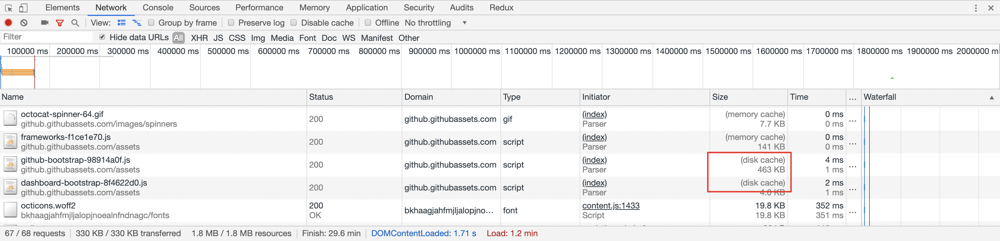

# 缓存

[🔝 首页](../README.md)

当浏览器想要获取远程的数据时，这时候我们的性能之旅就开始了。然而，我们并不会立即动身开发这趟漫长之旅（实际发送请求）。在计算机领域，很多优化与性能问题都会通过增加缓存层来解决，前端也不例外。同时，和许多后端服务一样，前端缓存也是多级的。

下面先来整体看一看我们的缓存之旅吧！

## 1. 本地数据存储

> 通过结合本地存储，在业务代码侧实现缓存。

对于一些请求，我们可以直接在业务代码侧进行缓存处理。可以使用的缓存方式包括了 `localStorage`、`sessionStorage`、`indexedDB`。把这块加入缓存的讨论也许会有争议，但利用好它确实能在程序侧做到一些自定义的缓存机制。

例如，假设我们页面上有一个日更新的榜单，那我们就可以做一个当日缓存：

```JavaScript
// 当用户加载站点中的榜单组件时，可以通过该方法获取榜单数据
async function readListData() {
    const info = JSON.parse(localStorage.getItem('listInfo'));
    if (isExpired(info.time, +(new Date))) {
        const list = await fetchList();
        return list;
    }
    return info.list;
}
```

localStorage 大家都比较了解了，indexedDB 大家可能会了解的更少一些。想要快速了解其使用方式可以看看[这篇文章](https://medium.com/free-code-camp/a-quick-but-complete-guide-to-indexeddb-25f030425501)<sup>[1]</sup>。

从前端视角看，这是一种本地存储；但如果从整个系统的维度来看，很多时候其实也是缓存链条中的一环。对于一些特殊的，轻量级的业务数据，可以考虑使用本地存储作为缓存。

## 2. 内存缓存（Memory）

当你访问一个页面及其子资源时，有的时候该出现一个资源被使用使用多次，例如一个「👍」图标。由于该资源已经存储在内存中，有时候再去请求一次反而就多次一举，浏览器内存则是最近、最快的响应场所。

内存缓存并无明确的标准规定，同时，它与 HTTP 语义下的缓存关联性不大，算是浏览器帮我们实现的优化，很多时候其实我们意识不到。

对内存缓存感兴趣，可以在[这篇文章](https://calendar.perfplanet.com/2016/a-tale-of-four-caches/)<sup>[2]</sup>的 Memory Cache 部分进一步了解。

## 3. Cache API

> 可以尝试做一些网络层的缓存，甚至实现一个离线 APP。

当我们没有命中内存缓存时，是否就开始发送请求了呢？其实不一定。

在这时我们还可能会碰到 Cache API 里的缓存，提到它就不得不提一下 Service Worker 了。它们通常都是配合使用的。

首先明确一下，这层的缓存没有相关的规范（即该缓存什么，什么情况进行缓存），它只是提供给了客户端构建请求的缓存机制的能力。如果你对 PWA 或者 Service Worker 很了解，应该非常清除是怎么一回事。如果不太了解也没有关系，下面我们可以简单看一下：

首先，Service Worker 是一个后台运行的独立线程，可以在代码中启用

```JavaScript
if ('serviceWorker' in navigator) {
    navigator.serviceWorker.register('./sw.js').then(function () {
        // 注册成功
    });
}
```

之后，处理一些 SW 的生命周期事件，而其中与缓存直接相关的功能则是请求拦截

```JavaScript
// sw.js
self.addEventListener('fetch', function (e) {
    // 如果有cache则直接返回，否则通过fetch请求
    e.respondWith(
        caches.match(e.request).then(function (cache) {
            return cache || fetch(e.request);
        }).catch(function (err) {
            console.log(err);
            return fetch(e.request);
        })
    );
});
```

以上代码便会拦截所有网络请求，查看是否有缓存的请求内容，如果有则返回缓存，否则才会发送请求。与内存缓存不同，Service Worker 中 Cache API 提供的缓存可以认为是“永久性”的，关闭浏览器或离开页面之后，下次再访问仍然可以使用。

Service Worker 中 Cache API 其实是一个功能非常强大的组合，而且能实现业务透明，同时在兼容性上也是渐进支持。还是非常推荐在业务中尝试的。当然上面代码简略了很多，想要进一步了解 Service Worker 和 Cache API 的使用可以看[这篇文章](https://juejin.im/post/5aca14b6f265da237c692e6f)<sup>[3]</sup>。同时推荐配合 Google 的 [Workbox](https://developers.google.com/web/tools/workbox/) 使用。

## 4. HTTP 缓存

> 善用 HTTP 缓存。

如果 Service Worker 中也没有缓存相关的请求信息，那么就会真正到 HTTP request 的阶段了。这个时候出现的就是我们所熟知的 HTTP 缓存规范。

HTTP 有一系列的规范来规定哪些情况下需要缓存请求信息、缓存多久，而哪些情况下不能进行信息的缓存。我们可以通过相关的 HTTP 来实现缓存。

这里简单提一下，HTTP 缓存大致可以分为强缓存与协商缓存。

### 4.1. 强缓存

在强缓存的情况下，浏览器不会向服务器发送请求，而是直接从本地缓存中读取内容，而这个“本地”一般就是来源与硬盘。这也就是我们在 Chrome Dev Tools 上经常看到的「disk cache」。



与其相关的响应头则是 `Expires` 和 `Cache-Control`。在 `Expires` 上可以设置一个过期时间，浏览器通过将其与当前本地时间对比，判断资源是否过期，未过期则直接从本地取即可。而 `Cache-Control` 则可以通过给它设置一个 `max-age`，来控制过期时间。例如，`max-age=300` 就是表示在响应成功后 300 秒内，资源请求会走强缓存。

### 4.2. 协商缓存

你可能也感觉到了，强缓存不是那么灵活。如果我在 300 秒内更新了资源，需要怎么通知客户端呢？常用的方式就是通过协商缓存。

我们知道，远程请求之所以慢，除了链接建立、链路上数据传输等操作耗时高外，另一个直接因素就是报文体积。协商缓存就是希望能通过先“问一问”服务器，资源到底有没有过期，来避免无谓的资源下载。这伴随的往往会是 HTTP 请求中的 304 响应码。下面简单介绍一下实现协商缓存的两种方式：

一种协防缓存的方式是通过服务器第一次响应时返回 `Last-Modified`，而浏览器在后续请求时带上其值作为 `If-Modified-Since`，相当于问服务端：2019年8月7号之后，这个脚本更新了么？服务其根据情况回答即可：更新了（返回 200）或没更新（返回 304）。

上面是通过时间来判断是否更新，还有一种则是通过标识。服务器第一次响应时返回 `ETag`，而浏览器在后续请求时带上其值作为 `If-None-Match`，一般会用文件的 MD5 作为 `ETag`。

作为前端工程师，一定要善于应用 HTTP 缓存。如果想要了解更多关于 HTTP 缓存的内容，可以阅读[这篇文章](https://github.com/amandakelake/blog/issues/41)<sup>[4]</sup>。

> 上面这些的各级缓存的匹配机制里，都是包含资源的 uri 的匹配，即 uri 更改后不会命中缓存。也正是如此，我们目前在前端实践中都会把文件 HASH 加入到文件名中，避免同名文件命中缓存的旧资源。

## 5. Push Cache

假如很不幸，以上这些缓存你都没有命中，那么你将会碰到最后一个缓存检查 —— Push Cache。

Push Cache 其实是 HTTP/2 的 Push 功能所带来的。简单来说，过去一个 HTTP 的请求连接只能传输一个资源，但是，现在你在请求一个资源的同时，服务端可以为你“推送”一些其他资源 —— 你可能在在不久的将来就会用到。例如，你在请求 www.sample.com 时，服务端不仅发送了页面文档，还一起推送了 关键 CSS 样式表。这也就避免了浏览器收到响应，解析到相应位置时才会请求所带来的延后。

不过 HTTP/2 Push Cache 是一个比较底层的网络特性，与其他的缓存有很多不同，例如：

- 当匹配上时，并不会在额外检查资源是否过期
- 存活时间很短，甚至短过内存缓存（例如有文章提到，Chrome 中为 5min 左右）
- 只会被使用一次
- HTTP/2 连接断开将导致缓存直接失效
- ……

如果对使用 HTTP/2 Push 感兴趣，可以看看[这篇文章](https://jakearchibald.com/2017/h2-push-tougher-than-i-thought/)<sup>[5]</sup>。

---

好了，到目前为止，我们可能还没有发出一个真正的请求。这也意味着，我们会有很多机会将后续的性能问题扼杀在摇篮之中 —— 如果网络请求都不必发出，又何须优化请求加载的性能呢？

所以，审视一下我们的应用、我们的业务，看看哪些性能问题是适合在这个源头上解决的。

不过往往来说，能通过缓存解决的问题只有一部分，甚至是一小部分。所以下面我们会继续这趟旅行。但是这是一个好的开始，不是么？

[下一站 - 发送请求 🔜](../2-request/README.md)

---

## 拓展阅读

下面是一些关于缓存的文章，包括上文提到的：

1. [A quick but complete guide to IndexedDB and storing data in browsers](https://medium.com/free-code-camp/a-quick-but-complete-guide-to-indexeddb-25f030425501)
1. [A Tale of Four Caches](https://calendar.perfplanet.com/2016/a-tale-of-four-caches/)
1. [PWA学习与实践：让你的WebApp离线可用](https://juejin.im/post/5aca14b6f265da237c692e6f)
1. [浏览器缓存机制：强缓存、协商缓存](https://github.com/amandakelake/blog/issues/41)
1. [HTTP/2 push is tougher than I thought](https://jakearchibald.com/2017/h2-push-tougher-than-i-thought/)
1. [Caching best practices & max-age gotchas](https://jakearchibald.com/2016/caching-best-practices/)
1. [The Offline Cookbook (Service Worker)](https://developers.google.com/web/fundamentals/instant-and-offline/offline-cookbook/)
1. [HTTP/2 ORG](https://http2.github.io/)
1. [Web Caching Explained by Buying Milk at the Supermarket](https://dev.to/kbk0125/web-caching-explained-by-buying-milk-at-the-supermarket-9k4?utm_source=mybridge&utm_medium=blog&utm_campaign=read_more)
1. [深入理解浏览器的缓存机制](https://mp.weixin.qq.com/s/y-yajw1GaWLKUdOJo3cbew)
