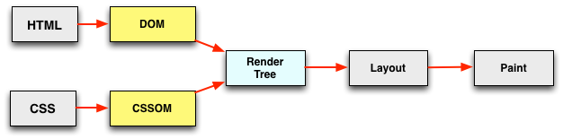
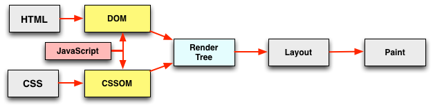
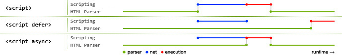

# 四、页面解析与处理

[🔙 上一站 - 服务端响应](../3-response/README.md)

在上一站中，我们简单介绍了服务端处理与响应，到目前为止我们已经经历了很多环节，也已经有了许多「性能优化的武器」。像是

- 利用各级缓存进行优化
- 提前进行 DNS 查询或建立连接等方式加速请求
- 在服务端避免不必要的耗时
- ……

不过，不要掉以轻心，后续仍然有大量的工作等待我们来优化。下面就到了客户端接收响应的阶段了。

## 主要工作

这一阶段浏览器需要处理的东西很多，为了更好地理解性能优化，我们主要将其分为几个部分：

- 页面 DOM 的解析；
- 页面静态资源的加载，包括了页面引用的 JavaScript/CSS/图片/字体等；
- 静态资源的解析与处理，像是 JavaScript 的执行、CSSOM 的构建与样式合成等；

大致过程就是解析页面 DOM 结构，遇到外部资源就加载，加载好了就使用。但是由于这部分的内容比较多，所以在这一节里我们重点关注页面的解析（其他部分在写一节中介绍）。

## 1. 注意资源在页面文档中的位置

我们的目标是收到内容就尽快解析处理，页面有依赖的资源就尽快发送请求，收到响应则尽快处理。然而，这个美好的目标也有可能会被我们不小心破坏。

JavaScript 脚本和 CSS 样式表在关于 DOM 元素的属性，尤其是样式属性上都有操作的权利。这就像是一个多线程问题。服务端多线程编程中经常通过锁来保证线程间的互斥。回到咱们的前端，现在也是两方在竞争同一个资源，显然也是会有互斥的问题。这就带来了 DOM 解析、JavaScript 加载与执行、CSS 加载与使用之间的一些互斥关系。

仅仅看 DOM 与 CSS 的关系，则如下图所示：

HTML 解析为 DOM Tree，CSS 解析为 CSSOM，两者再合成 Render Tree，并行执行，非常完美。然而，当 JavaScript 入场之后，局面就变了：

根据标准规范，在 JavaScript 中可以访问 DOM。因此当遇到 JavaScript 后会阻塞 DOM 的解析。于此同时，为避免 CSS 与 JavaScript 之间的竞态，CSSOM 的构建会阻塞 JavaScript 的脚本执行。总结起来就是 ——

> JavaScript 会阻塞 DOM 构建，而 CSSOM 的构建又回阻塞 JavaScript 的执行。

所以这就是为什么在优化的最佳实践中，我们基本都推荐把 CSS 样式表放在 `<head>` 之中（即页面的头部），把 JavaScript 脚本放在 `<body>` 的最后（即页面的尾部）。

关于这部分的一些解释可以看[这篇文章](https://calendar.perfplanet.com/2012/deciphering-the-critical-rendering-path/)[1]。

## 2. 使用 defer 和 async

上面提到了，当 DOM 解析遇到 JavaScript 脚本时，会停止解析，开始下载脚本并执行，再恢复解析，相当于是阻塞了 DOM 构建。

那除了将脚本放在 `body` 的最后，还有什么优化方法么？是有的。

可以使用 `defer` 或 `async` 属性。两者都会防止 JavaScript 脚本的下载阻塞 DOM 构建。但是两者也有区别，最直观的表现如下：

`defer` 会在 HTML 解析完成后，按照脚本出现的次序再顺序执行；而 `async` 则是下载完成就立即开始执行，同时阻塞页面解析，不保证脚本间的执行顺序。

根据它们的特点，推荐在一些与主业务无关的 JavaScript 脚本上使用 async。例如统计脚本、监控脚本、广告脚本等。这些脚本一般都是一份独立的文件，没有外部依赖，不需要访问 DOM，也不需要有严格的执行时机限制。在这些脚本上使用 `async` 可以有效避免这些非核心功能的加载影响页面解析速度。

## 3. 页面文档压缩

HTML 的文档大小也会极大影响响应体下载的时间。一般会进行 HTML 内容压缩（uglify）的同时，使用文本压缩算法（例如 gzip）进行文本的压缩。关于资源压缩这一块，在下一节的内容中还会再详细进行介绍。

---

说一句题外话，你知道与页面解析密切相关的 DOMContentLoaded 事件何时触发么？interactive/complete 等 readyState 具体代表什么么？如果不太了解可以从[HTML spec](https://html.spec.whatwg.org/multipage/dom.html#current-document-readiness)[2]里看。

用原话来说就是：

> Returns "loading" while the Document is loading, "interactive" once it is finished parsing but still loading subresources, and "complete" once it has loaded.

> The readystatechange event fires on the Document object when this value changes.

> The DOMContentLoaded event fires after the transition to "interactive" but before the transition to "complete", at the point where all subresources apart from async script elements have loaded.

---

好了，在这一站我们又了解了页面的解析过程及其性能优化。

正如开头所说，其实解析页面、加载资源、使用资源是三个紧密相关的过程。在这里我们主要着眼于页面的解析，而在「前端性能优化之旅」的下一站，我们则会一起来涉足到这部分的其他诸多优化点中。

[下一站 - 页面静态资源 🔜](../5-subresources/README.md)

---

## 参考资料

1. [Deciphering the Critical Rendering Path](https://calendar.perfplanet.com/2012/deciphering-the-critical-rendering-path/)
1. [HTML5 spec: current-document-readiness](https://html.spec.whatwg.org/multipage/dom.html#current-document-readiness)
1. [Async Defer — JavaScript Loading Strategies](https://medium.com/@raviroshan.talk/async-defer-javascript-loading-strategies-da489a0ba47e)
1. [Speed up Google Maps(and everything else) with async & defer](https://medium.com/@nikjohn/speed-up-google-maps-and-everything-else-with-async-defer-7b9814efb2b)
1. [HTML5 spec: parse HTML (the end)](https://html.spec.whatwg.org/multipage/parsing.html#the-end)
