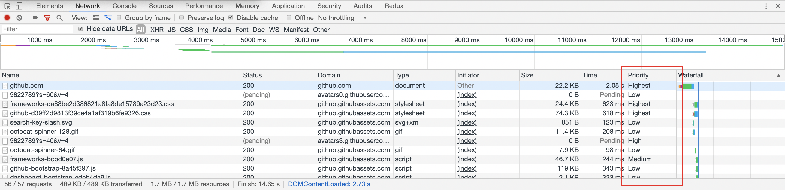
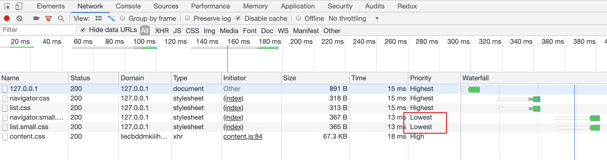

# CSS

[🔝 页面静态资源](./README.md) | [🔙 上一站 - JavaScript](../5-subresources/javascript.md)

在这一部分，我们来详细看一看与 CSS 相关的优化内容。其中一部分内容与 JavaScript 部分是类似的，另一部分可能是 CSS 特有的一些优化或注意事项。

## 1. 关键 CSS

在性能优化领域，其实我们会更关注关键渲染路径（Critical Rendering Path），而不一定是最快加载完整个页面。

CRP 是指优先显示与当前用户操作有关的内容。由于 CSS 会“间接”阻塞页面的解析，所以在这个过程中的 CSS 也被称为关键 CSS。识别出当前业务中的关键 CSS，优先下载与解析它，将会帮助我们更好降低延迟。

所以我们首先还是需要先建立好概念：很多时候，我们并不是在追求整体页面的最快加载，而是最核心最关键的那部分，例如在视频网站上可能是播放器、在文档站点可能是阅读器。

由于很多时候，关键 CSS 不会太大，因此有一种常见的优化措施是，将关键 CSS 的内容内联到 `head` 中，然后异步加载其他非关键 CSS。这样对于关键路径的渲染可以减少一次 RTT。用户可以更快看到一些页面初始的渲染结果。

经典的[骨架屏](https://uxdesign.cc/what-you-should-know-about-skeleton-screens-a820c45a571a)<sup>[1]</sup>可以算是这种思路的一个延展。我们会生成一个不包含实际功能的静态页面，将必要的脚本、样式、甚至图片（base64）资源都内联到其中，当用户访问时直接先返回该页面，就可以很快让用户看到页面结果，之后在异步渐进加载，就会让用户感觉“很快”。


骨架屏可以[手动编写](https://css-tricks.com/building-skeleton-screens-css-custom-properties/)<sup>[2]</sup>，当然也可以通过[编译插件](https://github.com/ElemeFE/page-skeleton-webpack-plugin)来帮助你[自动生成](https://zhuanlan.zhihu.com/p/34702561)<sup>[3]</sup>骨架屏。

## 2. 优化资源请求

### 2.1. 按需加载

与 JavaScript 类似，我们的 CSS 也是可以按需加载的。尤其在当下组件化盛行的潮流里，组件的按需加载就可能会包括了 JavaScript 脚本、CSS 样式表、图标图片。在上一部分介绍的 [Webpack Code Split](./javascript.md#user-content-11-代码拆分与按需加载) 也会包含这一部分。

除了使用一些构建工具以及对应的插件外，你也可以使用 [loadCSS](https://github.com/filamentgroup/loadCSS) 这样的库来实现 CSS 文件的按需异步加载。

### 2.2. 合并文件

同样的，参照 JavaScript，我们也可以把一些 CSS 文件进行合并，来介绍请求数量。

### 2.3. 请求的优先级排序

浏览器中的各类请求是有优先级排序的。低优请求会被排在高优之后再发送。



不过可惜的是，浏览器没有将优先级排序的能力给我们直接开放出来。不过在一些场景下，我们可以通过更合理的使用媒体类型和媒体查询来实现资源加载的优先级。下面会简单介绍一下。

一些网站为了达到不同屏幕之间的兼容，可能会使用媒体查询的方式来构建它的样式系统。一般而言，我们都会把样式代码写在一起，例如导航的在各类屏幕下的样式都会放在 `navigator.css` 下，列表都会放在 `list.css` 下。

```HTML
<link rel="stylesheet" href="navigator.css" />
<link rel="stylesheet" href="list.css" />
```

这里带来的一个问题就是，在宽度小于 400px 的场景下，其实并不需要应用于宽度 400px 以上的 CSS 样式。针对这个问题，`link` 标签上其实有一个 `media` 属性来处理媒体查询下的加载优先级。浏览器会优先下载匹配当前环境的样式资源，相对的，其他非匹配的优先级会下降。

```HTML
<link rel="stylesheet" href="navigator.css" media="all" />
<link rel="stylesheet" href="list.css" media="all" />
<link rel="stylesheet" href="navigator.small.css" media="(max-width: 500px)" />
<link rel="stylesheet" href="list.small.css" media="(max-width: 500px)" />
```

这样拆分后，当页面大于 500 px 时，`navigator.small.css` 和 `list.small.css` 的优先级会降低，同时，**它们也不再会阻塞页面的渲染**。需要注意的是，优先级降低只代表可能会后加载，并非不加载。



### 2.4. 慎用 `@import`

CSS 提供了一个 `@import` 语法来加载外部的样式文件。然而，这会把你的请求变得串行化。

考虑 `index.css` 这个资源，页面上是这么引用的：

```HTML
<link rel="stylesheet" href="index.css" />
```

而在 `index.css` 中引用了 `other.css`

```CSS
/* index.css */
@import url(other.css);
```

这样浏览器只有当下载了 `index.css` 并解析到其中 `@import` 时，才会再去请求 `other.css`。这是一个串行过程。

而如果我们把它改造为

```HTML
<link rel="stylesheet" href="index.css" />
<link rel="stylesheet" href="other.css" />
```

那就不需要等待 `index.css` 下载，几乎是并行的过程。

### 2.5. 谨慎对待 JavaScript 脚本的位置

在「4.页面解析与处理」部分，我们提到将 JavaScript 脚本放到页面尾部，CSS 放到页面头部的模式。这只是大多数情况的处理方式。对于一些特殊情况，我们还是需要特殊处理的。

还记得我们有提到一些统计类、监控类的第三方脚本么？一般而言，第三方会提供你如下一段脚本，然后推荐你内联到页面中：

```HTML
<script>
    var script = document.createElement('script');
    script.src = 'vendor.lib.js';
    document.getElementsByTagName('head')[0].appendChild(script);
</script>
```

我们希望通过这样的方式来尽快异步加载脚本。然而，如果我们一不小心出现了这样的操作，可能会事与愿违：

```HTML
<link rel="stylesheet" href="navigator.css" />
<script>
    var script = document.createElement('script');
    script.src = 'vendor.lib.js';
    document.getElementsByTagName('head')[0].appendChild(script);
</script>
```

这时，`navigator.css` 的加载会阻塞后面的 JavaScript 执行，这是为了防止后续脚本对样式的查询出现不确定性。所以，这两个资源就变成了串行加载。

要优化这个问题很简单 —— 调换一下顺序即可：

```HTML
<script>
    var script = document.createElement('script');
    script.src = 'vendor.lib.js';
    document.getElementsByTagName('head')[0].appendChild(script);
</script>
<link rel="stylesheet" href="navigator.css" />
```

这时，`vendor.lib.js` 和 `navigator.css` 就会并行加载了。当然，你需要确保不需要查询 `navigator.css` 样式应用后的信息。

## 3. 减少包体大小

### 3.1. 压缩

CSS 同样可以进行压缩，与 JavaScript 类似，也有相应的 CSS uglify 工具，例如 [clean-css](https://github.com/jakubpawlowicz/clean-css)，可以优化代码，删除多余的换行与空格。

同时，由于 CSS 同样是文本内容，因此针对文本的各类压缩算法同样适用，最常用到的就是 gzip。如何在 Nginx 上开启它[之前也介绍过了](./javascript.md#user-content-21-代码压缩)，这里就不赘述了。

### 3.2. 选择合适的兼容性

同样，配合 Browserslist 来实现你的业务场景下的兼容性。比较常见的是配合 [Autoprefixer](https://github.com/postcss/autoprefixer) 和 [PostCSS Preset Env](https://github.com/csstools/postcss-preset-env) 来使用。可以根据指定的支持浏览器范围，决定使用哪些 CSS Polyfill 来帮助你将新的 CSS 转换为旧的浏览器能识别的内容。

## 4. 解析与渲染树构建

https://www.sitepoint.com/optimizing-css-performance/

https://blog.nextzy.me/how-to-write-css-for-a-great-performance-web-application-edf75bb8a8cc

### 4.1. 简化选择器

在[《浏览器的工作原理：新式网络浏览器幕后揭秘》](https://www.html5rocks.com/zh/tutorials/internals/howbrowserswork/)一文中，作者介绍了样式计算的原理。虽然文章发布时间比较早了，但其中部分内容还是具有参考价值的。

其中指出了，样式数据是一个超大的结构，为每一个元素查找匹配的规则会造成性能问题（所以浏览器做了优化），同时，复杂的层叠规则也会带来很高的复杂度。如果感兴趣可以[具体看下这里](https://www.html5rocks.com/zh/tutorials/internals/howbrowserswork/#Style_Computation)<sup>[4]</sup>。

总而言之，我们应该尽量避免不必要的选择器复杂度。例如下面这个选择器：

```CSS
body > main.container > section.intro h2:nth-of-type(odd) + p::first-line a[href$=".pdf"] {
    /* …… */
}
```

不过一般情况下我们是不会写出如此复杂的选择器的。但有一个情况还是需要注意一下，就是使用 SASS、LESS 这样的工具时，避免过多的嵌套。以 LESS 为例：

```CSS
.list {
    .item {
        .product {
            .intro {
                .pic {
                    /* …… */
                }
            }
        }
    }
}
```

由于过多的嵌套，编译后会产生如下选择器：

```CSS
.list .item .product .intro .pic {
  color: red;
}
```

当然，你也可以考虑使用类似 [BEM](https://en.bem.info/) 这样的方式来进行 [CSS class 的组织与命名](https://www.jianshu.com/p/900e26060c09)<sup>[5]</sup>，从而避免过多的嵌套层级。这里有[一篇文章](https://www.sitepoint.com/optimizing-css-id-selectors-and-other-myths/)<sup>[6]</sup>介绍了选择器的匹配成本。

不过千万要注意了，代码的可维护性还是最重要的，不要为了过分简化选择器而放弃了代码语义和可维护性。我们仅仅是要尽量避免像上面那样的一些过分复杂的、或者不必要的繁琐的选择器。

### 4.2. 避免使用昂贵的属性

有一些 CSS 的属性在渲染上是有比较高的成本的，渲染速度相较而言也会慢些。在不同的浏览器上，具体的表现不太一致，但总体来说，下面一些属性是比较昂贵的：

- border-radius
- box-shadow
- opacity
- transform
- filter
- position: fixed

### 4.3. 使用先进的布局方式

对于页面布局，我们有很多方法，例如 [float、positioning、flex、grid](https://juejin.im/post/5b3b56a1e51d4519646204bb)<sup>[7]</sup> 等。float 本身并非设计出来并非是为了处理复杂的布局，但是通过大家的发掘和研究，可以通过它来实现很多布局需求。基于兼容性考虑，float 也成为了流行的布局方式。

不过，[一些文章](https://www.zhihu.com/question/271492607)<sup>[8]</sup>也指出，使用新版的 flex 进行布局比我们用的一些“老式”方法性能更好（例如基于 float 的浮动布局）。 flex 本身在移动端具有不错的兼容性，很多移动场景下已经大规模使用 flex 进行页面布局，同时，虽然 flex 有[兼容性要求](https://caniuse.com/#search=flex)，但由于很多 PC 站都不再兼容低版本 IE，因此也开始尝试使用它了。

如果你之前对 flex 了解不多，这里有一个不错的[教程](https://scrimba.com/g/gflexbox)可以帮你快速入门。

## 5. 利用缓存

与其他静态资源类似，我们仍然可以使用[各类缓存策略](../1-cache/README.md)来加速资源的加载。

此外，如果使用 Webpack 作为构建工具，我们一般会使用 css-loader 和 style-loader，这样可以直接在 JavaScript 代码中 import 样式文件。不过这样带来的一个问题就是样式代码其实是耦合在 JavaScript 代码中的，通过运行时添加 `style` 标签注入页面。一个更好的做法是在生产环境中将样式信息单独抽离成 CSS 文件，这样也可以更好地利用缓存。在 Webpack v4 之前的版本中，我们习惯于用 [ExtractTextWebpackPlugin 插件](https://github.com/webpack-contrib/extract-text-webpack-plugin)，不过在 v4 之后，对于 CSS 的抽取，推荐使用 [MiniCssExtractPlugin 插件](https://webpack.js.org/plugins/mini-css-extract-plugin/)，将样式信息单独抽离出 CSS 文件来。简单的使用方式如下：

```JavaScript
// webpack.config.js
const MiniCssExtractPlugin = require('mini-css-extract-plugin');
module.exports = {
  plugins: [
    new MiniCssExtractPlugin({
      filename: '[contenthash:8].css',
      chunkFilename: '[contenthash:8].css'
    }),
  ],
  module: {
    rules: [{
        test: /\.css$/,
        use: [
            MiniCssExtractPlugin.loader,
            'css-loader'
        ]
    }]
  }
};
```

---

相较于 JavaScript，用户对 CSS 的可控性可能会稍弱一些，所以，基础的优化点也许没有那么多。但随着 CSS 特性（例如 [Houdini/CSS Paint API](https://codersblock.com/blog/say-hello-to-houdini-and-the-css-paint-api/)）的不断发展，相信在其能力提升的同时，也会有更多我们需要关注的优化点。

下面会介绍一些关于图片的性能优化。

[下一站 - 图片 🔜](./image.md)

---

1. [Everything you need to know about skeleton screens](https://uxdesign.cc/what-you-should-know-about-skeleton-screens-a820c45a571a)
1. [Building Skeleton Screens with CSS Custom Properties](https://css-tricks.com/building-skeleton-screens-css-custom-properties/)
1. [自动化生成 H5 骨架页面](https://zhuanlan.zhihu.com/p/34702561)
1. [浏览器的工作原理：新式网络浏览器幕后揭秘](https://www.html5rocks.com/zh/tutorials/internals/howbrowserswork/#Style_Computation)
1. [使用 BEM-constructor 构建 CSS](https://www.jianshu.com/p/900e26060c09)
1. [Optimizing CSS: ID Selectors and Other Myths](https://www.sitepoint.com/optimizing-css-id-selectors-and-other-myths/)
1. [一篇全面的CSS布局学习指南(译)](https://juejin.im/post/5b3b56a1e51d4519646204bb)
1. [flex布局对性能的影响主要体现在哪方面？](https://www.zhihu.com/question/271492607)
1. [CSS and Network Performance](https://csswizardry.com/2018/11/css-and-network-performance/)
1. [Render Blocking CSS](https://developers.google.com/web/fundamentals/performance/critical-rendering-path/render-blocking-css)
1. [How to write CSS for a great performance web application](https://blog.nextzy.me/how-to-write-css-for-a-great-performance-web-application-edf75bb8a8cc)
1. [20 Tips for Optimizing CSS Performance](https://www.sitepoint.com/optimizing-css-performance/)
