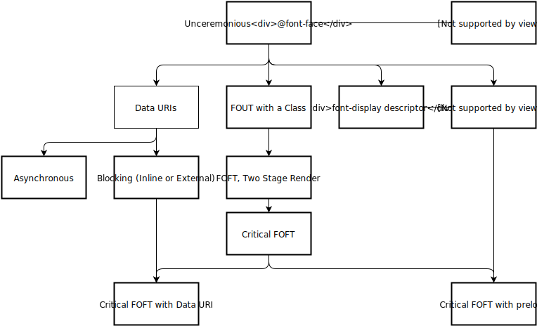

# 字体

[🔝 页面静态资源](./README.md) | [🔙 上一站 - 图片](../5-subresources/image.md)

有些时候，内置的字体并不能满足我们的需求，如果我们希望使用一些更有涉及性的字体，我们一般会使用 `@font-face` 来加载字体文件：

```CSS
@font-face {
    font-family: 'Samplefont';
    src: url(/static/samplefont.woff2) format('woff2'),
         url(/static/samplefont.woff) format('woff');
}
```

然而这种方式的一大问题就是，在字体加载的其间，页面是不展示文本内容的。即我们常说的 FOIT (Flash of Invisible Text)。在现代浏览器中，FOIT 持续至多 3 秒，带来糟糕的用户体验。所以在字体这部分的性能优化中，主要是关注点在于如何平滑的加载字体。下面有一些解决方案。

## 1. font-display

你可以为 `@font-face` 中设置 `font-display: swap`，他可以让 FOIT 的默认行为变为 FOUT (Flash of Unstyled Text)，即先会使用默认字体样式展示文本，字体加载完毕后再将文本的字体样式进行替换。

```CSS
@font-face {
    font-family: 'Samplefont';
    src: url(/static/samplefont.woff2) format('woff2'),
         url(/static/samplefont.woff) format('woff');
    font-display: swap;
}
```

font-display 的取值包括 `auto|block|swap|fallback|optional`，这里详细介绍了[各种值的使用场景](https://developers.google.com/web/updates/2016/02/font-display)<sup>[1]</sup>。不过目前该属性的[兼容性一般](https://caniuse.com/#feat=css-font-rendering-controls)。

## 2. 内联字体

我们在上一节介绍过，可以使用 base64 将图片“内联”到页面中。同样的，字体也可以使用这种方式，这样就避免异步加载字体时的 FOIT 或 FOUT。我们可以将字体文件转为 base64 的字符串，设置到 `@font-face` 里的 `src` 属性上：

```CSS
@font-face {
    font-family: 'Samplefont';
    src: url('data:application/x-font-woff;charset=utf-8;base64,d09GRgABAAAAAHyoABMAAAAA4XQAAQAAAAAAAAAAAAAAAAAAAAAAAAAAAABG…') format('woff2');
}
```

但这种方式会导致在一个 `@font-face` 中只能加载加载一种字体类型。同时，与使用内联图片一样，这也会将本可以并行请求的数据量变为串行。

## 3. 使用 CSS Font Loading API

[CSS Font Loading API](https://developer.mozilla.org/en-US/docs/Web/API/CSS_Font_Loading_API) 是浏览器提供的，可以用来自定义控制字体加载的 API。这样你就可以在 JavaScript 中进行字体的加载，加载完成后，再将需要应用新字体的元素设置为对应的样式，例如添加一个对应的 className。这里介绍了[如何使用 CSS Font Loading API](https://medium.com/@matuzo/getting-started-with-css-font-loading-e24e7ffaa791)<sup>[2]</sup>。

不过目前 [CSS Font Loading API 兼容性](https://caniuse.com/#feat=font-loading)比较差，而由于一些困难也[无法实现一个符合标准的 polyfill](https://github.com/bramstein/fontloader#deprecated)。因此如果想要使用类似的能力，可以考虑使用 [Font Face Observer](https://github.com/bramstein/fontfaceobserver)这个库。简单的使用方式如下：

```JavaScript
var font = new FontFaceObserver('Samplefont');

font.load(null, 5000).then(function () {
    document.documentElement.classList.add('loaded');
}, function () {
    console.log('Font is not available');
});
```

```CSS
@font-face {
    font-family: 'Samplefont';
    src: url(/static/samplefont.woff2) format('woff2'),
         url(/static/samplefont.woff) format('woff');
}

body {
    font-family: sans-serif;
}

.loaded h1 {
    font-family: Samplefont, sans-serif;
    font-weight: 700;
}
```

## 4. FOFT

在需要加载同一字体的粗体、斜体时，FOFT (Flash of Faux Text) 方法会非常有效。首先你需要知道的是，对于一种字体，它的斜体与粗体是有专门的字符集的；与此同时，如果你指定了某种字体的粗体，但浏览器没有加载，那么你可以使用 [`font-synthesis` 属性](https://developer.mozilla.org/en-US/docs/Web/CSS/font-synthesis)来让浏览器帮你模拟。而当实际的粗体或斜体加载完毕后，在使用实际的字体集。

其实践起来主要还是借助上面提到的 CSS Font Loading API 或者 Font Face Observer 来实现字体加载完毕后的样式修改。

---

你会发现，关于字体的性能优化主要集中于：如何通过加载策略来降低甚至消除 FOIT 所带来的文本“空白”时间。当然上面提到的这些策略与技术你可以组合使用，来达到所需的优化效果。

如果还想了解更多关于字体加载的问题，[这篇文章](https://www.zachleat.com/web/comprehensive-webfonts/)<sup>[3]</sup>很合适，它总结了各类加载策略，并提供了相应的示例。



关于字体的性能优化就到这了，下面我们会进入到页面资源优化的最后一站 —— 视频。

[下一站 - 视频 🔜](./video.md)

---

## 参考资料

1. [Controlling Font Performance with font-display](https://developers.google.com/web/updates/2016/02/font-display)
1. [Getting started with CSS Font Loading](https://medium.com/@matuzo/getting-started-with-css-font-loading-e24e7ffaa791)
1. [A COMPREHENSIVE GUIDE TO FONT LOADING STRATEGIES](https://www.zachleat.com/web/comprehensive-webfonts/)
