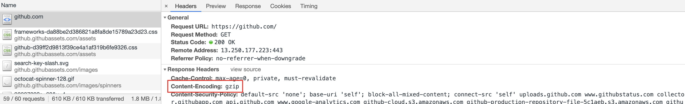
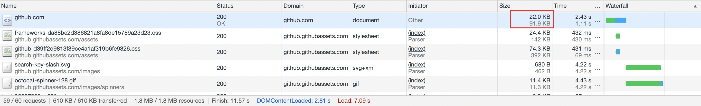
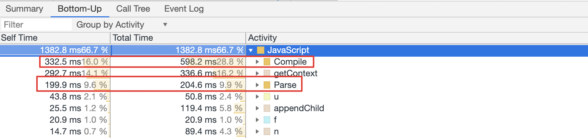
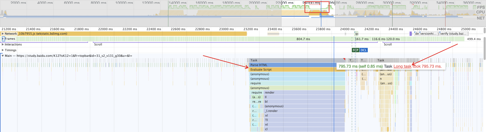
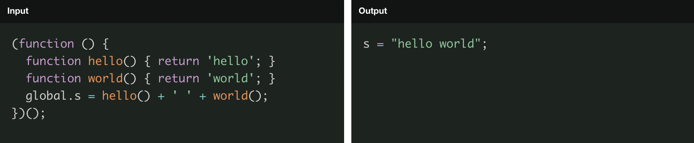

# JavaScript

[🔝 页面静态资源](./README.md)

随着 Web 的发展，JavaScript 从以前只承担简单的脚本功能，到现在被用于构建大型、复杂的前端应用，经历了很大的发展。这也让它在当下的前端应用中扮演了一个非常重要的角色，因此在这一节首先来看看的我们熟悉的 JavaScript。

## 1. 减少不必要的请求

在进行 JavaScript 优化时，我们还是秉承总体思路，首先就是减少不必要的请求。

### 1.1. 代码拆分与按需加载

相信熟练使用 Webpack 的同学对这一特性都不陌生。

虽然整体应用的代码非常多，但是其实很多时候，我们在访问一个页面时，并不需要把其他页面的组件也全部加载过来，完全可以等到访问其他页面时，在按需去动态加载。其核心实现思路就是如下所示：

```JavaScript
btn.addEventListener('click', function(e) {
    // 在这里加载 chat 组件相关资源 chat.js
    var script = document.createElement('script');
    script.src = '/static/chat.js';
    document.getElementsByTagName('head')[0].appendChild(script);
});
```

当点击按钮时，动态添加 `script` 元素，这样就保证只有在点击按钮是，才会加载对应的 JavaScript 脚本。

以 Webpack 为例，在日常使用时，最常见的就是通过 [dynamic import](https://github.com/tc39/proposal-dynamic-import)<sup>[1]</sup> 来告诉 Webpack 去做 Code Split。Webpack 编译时在语法分析后遇到 dynamic import 就会认为这个模块是需要动态加载，相应的其子资源也会被如此处理（除非被其他非动态模块也引用了）。

在 Webpack 中使用代码拆分最常见的一个场景是路由级别的代码拆分。目前很多前端应用都在使用 SPA（单页面应用）形式，或者 SPA 与 MPA（多页面应用）的结合体，这就会涉及到前端路由。而页面间的业务差异也让基于路由的代码拆分成为一个最佳实践。想了解如何结合 React-Router4 来实现路由级别的代码拆分，可以看[这篇文章](https://www.jianshu.com/p/547aa7b92d8c)<sup>[2]</sup>。

当然，如果你不使用 Webpack 之类的构建工具，你也可以选择一个 AMD 模块加载器，例如 [RequireJS](https://requirejs.org/)，来实现前端运行时上对异步依赖的加载。

### 1.2. 代码合并

我们在总体思路里有提到，减少请求的一个方法就是合并资源。试想一个极端情况：我们现在并不对 node_modules 中的代码进行打包合并，那么当我们请求一个脚本之前将可能会并发请求数十甚至上百个依赖的脚本库。同域名下的并发请求数过高会导致请求排队，而 TCP/IP 下的慢启动也会让让每请求的平均速率很低。

当然，在很多流行的构建工具中（Webpack/Rollup/Parcel），是默认会帮你把依赖打包到一起的。不过在使用其他一些工具时，就需要注意了。例如使用 [FIS3](https://fis.baidu.com/fis3/docs/pack.html) 时，就需要进行以的配置声明，将一些 common 库，或者 npm 依赖进行打包合并。又或者使用 Gulp 处理文件内容，然后通过运行时模块化方案加载依赖（没有使用像 browserify 这样的工具）时，也需要特殊处理下。

千万不要你的碎文件散落一地。

## 2. 减少包体大小

### 2.1. 代码压缩

代码压缩比较常见的做法就是使用 [UglifyJS](http://lisperator.net/uglifyjs/) 做源码级别的压缩，它会通过替换将变量替换为短命名、去掉多余的换行符等方式，在尽量不改变源码逻辑的情况下，做到代码体积的压缩。基本已经成为了前端开发的标配。在 Webpack 的 production 模式下是默认开启的；而在 Gulp 这样的任务流管理工具上也有 [gulp-uglify](https://github.com/terinjokes/gulp-uglify) 这样的功能插件。

另一个代码压缩的常用手段是使用一些算法进行文本压缩，gzip 就是常用的一种方式。



可以看到，图中响应头的 `Content-Encoding` 表示其使用了 gzip。



深色的数字表示压缩后的大小为 22.0KB，浅色部分表示压缩前的大小为 91.9KB。可见压缩比还是挺大的，非常有效果。一般服务器都会内置有相应模块来进行 gzip 处理，不需要单独便写压缩算法模块。例如在 Nginx 中就包含了 [ngx_http_gzip_module](http://nginx.org/en/docs/http/ngx_http_gzip_module.html)<sup>[3]</sup> 模块，通过简单的配置就可以开启。

```nginx
gzip            on;
gzip_min_length 1000;
gzip_proxied    expired no-cache no-store private auth;
gzip_types      text/plain application/xml;
```

### 2.2. Tree Shaking

Tree Shaking 最早进入到前端的视线主要是因为 Rollup。后来在 Webpack 中也被实现了。其本质是通过检测源码中不会被使用到的部分，将其删除，从而减小代码的体积。例如：

```JavaScript
// 模块 A
export function add(a, b) {
    return a + b;
}

export function minus(a, b) {
    return a - b;
}
```

```JavaScript
// 模块 B
import {add} from 'module.A.js';
console.log(add(1, 2));
```

可以看到，模块 B 引用了模块 A，但是只使用了 `add` 方法，而 `minus` 方法变为了 Dead Code，将它打包进去没有意义，因为永远不会使用。

注意，我在上面的代码中使用了 ESM 规范的模块语法，而没有使用 CommonJS。这主要是由于 Tree Shaking 算是一种静态分析，而 ESM 本身是一种的静态模块化规范，所有依赖可以在编译期确定。如果想要更好得在 Webpack 中使用，可以在查看其[官网上的这部分内容](https://webpack.js.org/guides/tree-shaking/)<sup>[4]</sup>。关于 Tree Shaking 的介绍可以[从这里了解下](https://juejin.im/post/5a4dc842518825698e7279a9)<sup>[5]</sup>。

注意，刚才说了 Tree Shaking 非常依赖与 ESM，像是前端流行的工具库 [lodash](https://lodash.com/) 一般直接安装的版本是非 ESM 的，为了支持 Tree Shaking，我们一般会安装它的 ESM 版本 —— [lodash-es](https://www.npmjs.com/package/lodash-es) 来[实现 Tree Shaking](https://www.zhihu.com/question/333421533/answer/764963886)<sup>[6]</sup>。

此外，Chrome Dev Tools 也可以帮助你查看加载的 [JavaScript 代码的使用覆盖率](https://developers.google.com/web/updates/2017/04/devtools-release-notes#coverage)<sup>[7]</sup>。

### 2.3. 优化 polyfill 的使用

前端技术的一大特点就是需要考虑兼容性。而为了让大家能顺畅地使用浏览器的新特性，一些程序员们开发了新特性对应的 polyfill，用于在非兼容浏览器上也能使用新特性的 API。后续升级只需要删除相应的 polyfill 即可。

这种舒适的开发体验也让 polyfill 在项目中的使用成为了不可获取的一份子。然而，polyfill 也是有代价的，它将增加代码的体积。毕竟 polyfill 也是 JavaScript 写的，不是内置在浏览器中，引入的越多，代码体积也越大。所以，只加载真正所需的 polyfill 将会帮助你减小代码体积。

首先，不是每个业务的兼容性要求都一样。因此，按你业务的场景来确定引入哪些 polyfill 是最合适的。然而，特性千千万，手动 import 或者添加 Babel Transformer 显然是一件成本极高的事。针对这点，我们可以通过 Browserslist 来帮忙，许多前端工具（babel-preset-env/autoprefixer）都依赖于它。使用方式可以[看这里](https://babeljs.io/docs/en/next/babel-preset-env.html)。

其次，在 Chrome Dev Summit 2018 上还介绍了一种 [Differential Serving](https://youtu.be/reztLS3vomE?t=1254)<sup>[8]</sup> 的技术，通过浏览器原生模块化 API 来尽量避免加载无用 polyfill。

```HTML
<script type="module" src="main.mjs"></script>
<script nomodule src="legacy.js"></script>
```

这样，在能够处理 module 的浏览器（具有很多新特性）就只需加载 `main.mjs`（不包含 polyfill），而在老式浏览器下，则会加载 `legacy.js`（包含 polyfill）。

最后，其实在理想上，polyfill 最优的使用方式应该是根据浏览器特性来分发，不同浏览器、不通的业务需求，会加载不同的 polyfill 文件。例如像 [Polyfill.io](https://polyfill.io/v3/) 就会根据请求头中浏览器型号与所请求的特性来按实际情况返回必须的 polyfill 集合。

### 2.4. Webpack

Webpack 现在已经成为很多应用的构建工具，因此这里单独将其列了出来。我们可以通过 [Webpack Bundle Analyzer](https://github.com/webpack-contrib/webpack-bundle-analyzer) 这个工具来查看打包代码里面各个模块的占用大小。


导致打包体积过多的大部分问题都是来自于引入了不合适的包，对于如何优化依赖包的引入，这里有一些[建议](https://github.com/GoogleChromeLabs/webpack-libs-optimizations)<sup>[9]</sup>可以帮助你减小 bundle 的体积。

## 3. 解析与执行

除了 JavaScript 下载需要耗时外，脚本的解析与执行也是会消耗时间的。

### 3.1. JavaScript 的解析

很多情况下，我们会忽略 JavaScript 文件的解析。一个 JavaScript 文件，即使下载下来后并不会立即执行一些“重度”的方法，但 JavaScript 引擎对其进行解析与编译也是会耗时。



从[上图](https://twitter.com/addyosmani/status/830126731470073857)可以看出，解析与编译消耗了好几百毫秒。所以换一个角度来说，删除不必要立即使用的代码，对于降低 Parse 与 Compile 的负载也是很有帮助的。

同时，我们从前一节已经知道，由于 JavaScript 的解析/编译和执行会阻塞页面解析，延迟用户交互。所以有时候，加载同样大小的 JavaScript 对性能的影响可能会高于图片，因为图片的处理可以放在其他线程中异步执行。

### 3.2. 避免 Long Task

对于一些单页应用，在加载完核心的 JavaScript 资源后，可能会需要执行大量的逻辑。对于一些情况，如果处理不好，将会出现 JavaScript 线程长时间执行而阻塞了主线程。



例如在上图中，可看到帧率下降明显的地方出现了 Long Task，伴随着的，是有一段超过 700 ms 的脚本执行时间。而性能指标 FCP 与 DCL 处于其后，一定程度上可以怀疑，这个 Long Task 阻塞了主线程并拖慢了页面的交互时间，严重影响了前端性能与体验。

想要了解更多关于 Long Task 的内容，可以[看这里](https://w3c.github.io/longtasks/)<sup>[10]</sup>。

### 3.3. 是否真的需要框架？

我相信，如果我现在问大家，我们是否需要 React、Vue、Angular 或者其他的前端框架（库）来帮我们更好的开发，大概率是肯定的。

但是我们可以换个角度来思考这个问题。类库/框架帮我们解决的问题是如何写好代码，很多时候，类库/框架的开发者是需要在可维护性、易用性和性能上做取舍的。对于一个复杂的整站应用，使用框架给你的既定的编程范式将会在各个层面提升你工作的产出。但是，对于某些页面，我们是否可以反其道行之呢？

例如产品经理反馈，咱们的落地页加载太慢了，用户容易流失。这时候你会开始优化性能，当然，你可以用上这次「性能之旅」里了解的各种措施。但你有没有考虑过，对于一些落地页，其实基本就是静态页（或者再加个轮播图）。你是用了 React 技术栈 —— 你加载了 React、Redux、React-Redux、你的一堆 Reducers…… 好吧，整个 JavaScript 可能快 1MB 了。更可怕的是，这个页面可能是用于拉新的，这也代表着访问者并没有缓存可以用。好吧，为了一个静态页和轮播图，用户付出了高额的成本，而原本这只需要 50 行不到的代码。关于这部分的实践，[Netflix 有一篇相关文章](https://medium.com/dev-channel/a-netflix-web-performance-case-study-c0bcde26a9d9)<sup>[11]</sup>。

当然，并不是说不要使用框架/类库，它们很有价值，但我只是希望大家不要拘泥于某个思维定式。

### 3.4. 针对代码的优化

> 请注意，以下内容尽量不要在生产环境大规模使用。

还有一种加快代码解析与执行的思路就是把代码变为最优状态。它其实算是一种编译优化。在一些编译型的静态语言上（例如 C++），通过编译器进行一些优化非常常见。

这里要提到的就是 facebook 推出的 [Prepack](https://prepack.io/)。例如下面一段代码可以优化为：



不过很多时候，代码体积和运行性能是会有矛盾的。而 Prepack 也还不够成熟，所以不建议在生产环境中使用。

## 4. 缓存

JavaScript 部分的缓存与我们在第一节里提到的缓存基本一致，如果你记不太清了，[可以回去再重新看一下](../1-cache/README.md)。

### 4.1. 发布与部署

这里简单提一下：大多数情况下，我们对于 JavaScript 与 CSS 这样的静态资源，都会启动 HTTP 缓存。当然，可能是使用强缓存，也有可能是使用协商缓存。那么，如果我们使用强缓存的时候，如何让浏览器弃用缓存，而请求新的资源呢？

一般会有一套配合的方式：首先文件名会包含文件内容的 Hash，内容修改后，文件名就会变化；同时，设置不对页面进行强缓存，这样对于内容更新的资源由于 URI 变了，肯定不会再走缓存，而没有变动的资源则仍然可以使用缓存。

上面说的主要涉及前端资源的发布和部署，详细可以看[这篇内容](https://www.zhihu.com/question/20790576/answer/32602154)<sup>[12]</sup>，这里就不展开了。

### 4.2. 将基础库代码打包合并

为了更好利用缓存，我们一般会把不容易变化的部分单独抽取出来。例如一个 React 技术栈的项目，可能会将 React、Redux、React-Router 之类的基础库单独打包出一个文件。

这样做的优点就是，当业务代码变动（一般是较为经常的），那么由于基础库也被打包在一起了，所以整个缓存都会失效，基础框架/库，或者是你自己项目中的 common、util部分又会被重新加载一次（即使你从不会去升级它们）。而整套基础框架/库、工具库一般都不小。这就可能使得每次发布都会让用户花费不必要的带宽。

所以一种常见的策略就是[将基础库这种 Cache 周期较长的内容单独打包在一起](https://juejin.im/post/5aed037b6fb9a07aa047e1e1)，利用缓存减少新版本发布后用户的访问速度。

Webpack 在 v3 以及 v3 之前，可以通过 CommonChunkPlugin 来分离一些公共库。而升级到 v4 之后有了一个新的配置项 `optimization.splitChunks`:

```JavaScript
// webpack.config.js
module.exports = {
    //...
    optimization: {
        splitChunks: {
            chunks: 'all',
            minChunks: 1,
            cacheGroups: {
                commons: {
                    minChunks: 1,
                    automaticNamePrefix: 'commons',
                    test: /[\\/]node_modules[\\/]react|redux|react-redux/,
                    chunks: 'all'
                }
            }
        }
    },
}
```

### 4.3. 减少 Webpack 编译不当带来的缓存失效

由于 Webpack 已经成为前端项目的主流构建工具，因此这里特别提一下使用 Webpack 时的一些注意点，减少一些不必要的缓存失效。

我们知道，对于每个模块 Webpack 都会分配一个唯一的模块 ID，一般情况下 Webpack 会使用自增 ID。这就可能导致一个问题：一些模块虽然它们的代码没有变化，但由于添加了新的其他模块，导致后续所有的模块 ID 都变更了，文件 MD5 也就变化了。另一个问题是在于，Webpack 的入口文件除了包含它的 runtime、业务模块代码，同时还有一个异步加载的小型 manifest，任何一个模块的变化，最后必然会传导到入口文件。这些都会使得网站发布后，没有改动的源码的资源也会缓存失效。

规避这些问题有一些常用的方式。

**1) 使用 Hash 来替代自增 ID：**

你可以使用 [HashedModuleIdsPlugin 插件](https://webpack.js.org/plugins/hashed-module-ids-plugin/)，它会根据模块的相对路径来计算 Hash 值。当然，你也可以使用 Webpack 提供的 [`optimization.moduleIds`](https://webpack.js.org/configuration/optimization/#optimizationmoduleids)，将其设置为 `hash`，或者选择你需要的方式。

**2) 将 runtime chunk 单独拆分出来：**

通过 [`optimization.runtimeChunk` 配置](https://webpack.js.org/configuration/optimization/#optimizationruntimechunk)可以让 Webpack 把包含 manifest 的 runtime 部分单独分离出来，这样就可以尽可能限制变动影响的文件范围。

```JavaScript
// webpack.config.js
module.exports = {
    //...
    optimization: {
        runtimeChunk: {
            name: 'runtime'
        }
    },
}
```

> 如果你对 Webpack 模块化 runtime 运行的原理不太了解，可以看看[这篇文章](https://juejin.im/post/5b82ac82f265da431d0e6d25)<sup>[13]</sup>。

**3) 使用 records：**

你可以通过 [`recordsPath` 配置](https://webpack.js.org/configuration/other-options/#recordspath)来让 Webpack 产出一个包含模块信息记录的 JSON 文件，其中包含了一些模块标识的信息，可以用于之后的编译。这样在后续的打包编译时，对于被拆分出来的 Bundle，Webpack 就可以根据 records 中的信息来尽可能不破坏缓存。

```JavaScript
// webpack.config.js
module.exports = {
  //...
  recordsPath: path.join(__dirname, 'records.json')
};
```

如果对上述尽量避免或减少缓存失效的方法感兴趣，也可以在读一读[这篇文章](https://survivejs.com/webpack/optimizing/separating-manifest/#using-records)<sup>14</sup>。

---

这一部分就到这里了，我们基于减少不必要的请求、减少包体大小、降低资源执行/使用时的消耗、利用缓存这四个基本思想，展开去看了下 JavaScript 资源的性能优化措施有哪些。下面我们就会进入前端三驾马车之一的 CSS 了！

[下一站 - CSS 🔜](./css.md)

---

## 拓展阅读

1. [Proposal Dynamic Import](https://github.com/tc39/proposal-dynamic-import)
1. [在 react-router4 中进行代码拆分](https://www.jianshu.com/p/547aa7b92d8c)
1. [Module ngx_http_gzip_module](http://nginx.org/en/docs/http/ngx_http_gzip_module.html)
1. [Tree Shaking - Webpack](https://webpack.js.org/guides/tree-shaking/)
1. [Tree Shaking 性能优化实践 - 原理篇](https://juejin.im/post/5a4dc842518825698e7279a9)
1. [Tree Shaking for Lodash](https://www.zhihu.com/question/333421533/answer/764963886)
1. [CSS and JS code coverage - Chrome Dev Tools](https://developers.google.com/web/updates/2017/04/devtools-release-notes#coverage)
1. [Chrome Dev Summit 2018](https://youtu.be/reztLS3vomE?t=1254)
1. [Optimize your libraries with webpack](https://github.com/GoogleChromeLabs/webpack-libs-optimizations)
1. [Long Tasks API 1](https://w3c.github.io/longtasks/)
1. [A Netflix Web Performance Case Study](https://medium.com/dev-channel/a-netflix-web-performance-case-study-c0bcde26a9d9)
1. [大公司里怎样开发和部署前端代码？](https://www.zhihu.com/question/20790576/answer/32602154)
1. [webpack进阶：前端运行时的模块化设计与实现](https://juejin.im/post/5b82ac82f265da431d0e6d25)
1. [Separating a Manifest](https://survivejs.com/webpack/optimizing/separating-manifest/#using-records)
1. [The cost of JavaScript in 2019](https://v8.dev/blog/cost-of-javascript-2019)
1. [[译] 2019 年的 JavaScript 性能](https://juejin.im/post/5d1f27285188252f275fdbb6)
1. [webpack 4: Code Splitting, chunk graph and the splitChunks optimization](https://medium.com/webpack/webpack-4-code-splitting-chunk-graph-and-the-splitchunks-optimization-be739a861366)
1. [文本压缩算法的对比和选择](https://www.cnblogs.com/zhuxian8/p/7197356.html)
1. [简单聊聊 GZIP 的压缩原理与日常应用](https://zhuanlan.zhihu.com/p/42418273)
1. [Text Compression](https://www.sciencedirect.com/topics/computer-science/text-compression)
1. [Better tree shaking with deep scope analysis](https://medium.com/webpack/better-tree-shaking-with-deep-scope-analysis-a0b788c0ce77)
1. [How we reduced our initial JS/CSS size by 67%](https://dev.to/goenning/how-we-reduced-our-initial-jscss-size-by-67-3ac0)
