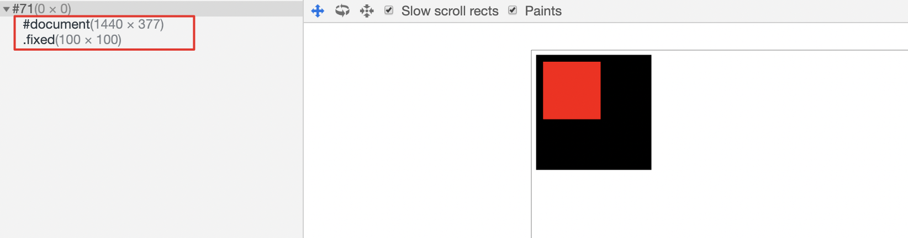

# 运行时

## 1. 注意强制同步布局

**1) 什么是 reflow/layout：**

作为前端，大家应该对“强制同步布局”并不陌生。如果你不太了解，这里简单介绍一下。首先，你需要知道的是，显示器有一个自己的刷新频率，例如每秒 60 次（60 FPS）。这就意味着，每过 16.6ms，浏览器就会将截止上次刷新后的元素变动计算并应用到屏幕上。这里就不得不提到渲染管线了。


在渲染管线中，有一步叫做 Layout，也就是布局。它会计算元素的大小、位置信息，而且一处的改动几乎会影响到整个文档页面。所以 Layout 的消耗是非常巨大的。而我们所说的 reflow（firefox）与 layout（Chrome/Opera/Safari/IE），也就是这一过程。另一方面，渲染线程和 JavaScript 执行线程是互斥的，这 16.6ms 中还会包含了 JavaScript 的执行，所以有些时候时间并不会那么“富裕”。

有一些 JavaScript 操作会导致浏览器需要提前执行布局操作，这种操作就被称为“强制同步布局”。

```JavaScript
var $ele = document.getElementById('main');
$ele.classList.remove('large');
var height = $ele.offsetHeight;
// ……
```

由于我们在修改了元素的 className 后又立刻获取其高度，为了保证高度值正确，浏览器会立即进行布局，然而我们的本意可能并非如此：也许 `large` 并不会影响高度，也许我们只是想获取上一帧的结果。那么下面这种写法会更合适，同时可以避免强制同步布局。

```JavaScript
var height = $ele.offsetHeight;
var $ele = document.getElementById('main');
$ele.classList.remove('large');
// ……
```

从这个例子可以看到，我们很可能一不小心就触发了强制同步布局。除了上例中的 `offsetHeight`，还有许多会[触发强制同步布局](https://gist.github.com/paulirish/5d52fb081b3570c81e3a)<sup>[1]</sup>的 API。[CSS Triggers](https://csstriggers.com/)<sup>[2]</sup> 这个网站则是在 Layout 之外，列出了各个浏览器中触发 Paint 和 Composite 的 CSS 属性。

**2) 避免在不合适的时机触发：**

上面可以算是一种在不合适的时机触发了重排的例子。还有一些更严重的列子，例如在循环中不断触发强制同步布局。

如果你希望避免在浏览器进行页面重绘后执行一些操作，你可以使用 [`requestAnimationFrame`](https://developer.mozilla.org/en-US/docs/Web/API/window/requestAnimationFrame) API。由于上一帧的旧布局值是可以直接获取的，所以我们可以将布局查询的操作放在 `requestAnimationFrame` 中。

```JavaScript
window.requestAnimationFrame(function () {
    var $ele = document.getElementById('main');
    var height = $ele.offsetHeight;
    // ……
});
```

但是千万注意，如果像下面这样犯了和之前一样的错误，在查询布局之前设置了新的元素样式/布局属性，那使用了 `requestAnimationFrame` 也无法避免性能问题。

```JavaScript
window.requestAnimationFrame(function () {
    var $ele = document.getElementById('main');
    $ele.classList.remove('large');
    var height = $ele.offsetHeight;
    // ……
});
```

**3) 批量化你的操作：**

批量化是计算机程序各类优化中的重要手段之一。例如一些数据库在写操作上最终也是会将其批量化进行磁盘 I/O。对于元素布局的查询操作，我们也可以尝试使用这种手段，将这些操作批量化存储下来，等到下一次 `requestAnimationFrame` 触发时一起执行。[FastDom](https://github.com/wilsonpage/fastdom) 就是一个帮你封装了这类操作的开源库。

> By batching DOM access we avoid unnecessary document reflows and dramatically speed up layout performance. Each measure/mutate job is added to a corresponding measure/mutate queue. The queues are emptied (reads, then writes) at the turn of the next frame using window.requestAnimationFrame.

上面是它的基本工作原理，和咱们说的思路是一样的。使用也非常简单：

```JavaScript
fastdom.measure(() => {
    const width = element.clientWidth;
});
```

```JavaScript
fastdom.mutate(() => {
    element.style.width = width + 'px';
});
```

## 2. 长列表优化

有些时候，你可能会需要在页面上展示一个包含上百个元素的列表（例如一个 Feed 流）。每个列表元素还有着复杂的内部结构，这显然提高了页面渲染的成本。甚至当你使用一些像 React 这样的库时，长列表的问题会被进一步放大。那么，有没有什么方法来优化长列表呢？

### 2.1. 实现 Virtual List

Virtual List 是一种用来优化长列表的技术。它可以保证在列表元素不断增加，或者列表元素很多的情况下，依然拥有很好的滚动、浏览性能。它的核心思想在于：只渲染可见区域附近的列表元素。下图左边就是 Virtual List 的效果，可以看到只有视口内部和临近的上下区域内的元素会被渲染。


不过这样带来的一个问题就是，由于只渲染固定 N 个元素，所以在页面滚动后，它们仍然留在原位。解决的方式就是使用 `position: absolute` 或者 `transform: translate()` 这样的属性，来手动设置展示元素的偏移量。

所以其大致的实现思路如下：

1. 监听页面滚动（或者其他导致视口变化的事件）；
1. 滚动时根据滚动的距离计算需要展示的列表项；
1. 将列表项中展示的数据与组件替换成当前需要展示的内容；
1. 修改偏移量到对应的位置。

这样还有一个好处，相当于是不断改变这 N 个元素的位置属性和内部的一些节点，不会有频繁的 DOM 创建与销毁，配合下面要提到的 composite 可以获得非常不错的性能。

如果你想要使用这项技术，除了自己实现外，一些常见的框架也有不错的开源实现。例如

- 基于 React 的 [react-virtualized](https://github.com/bvaughn/react-virtualized)，它的开发者也在 [dev.to 上分享了一些关于 virtual list 的内容](https://dev.to/nishanbajracharya/what-i-learned-from-building-my-own-virtualized-list-library-for-react-45ik)<sup>[3]</sup>；
- 基于 Vue 的 [vue-virtual-scroll-list](https://github.com/tangbc/vue-virtual-scroll-list)；
- 基于 Angular 的 [ngx-virtual-scroller](https://github.com/rintoj/ngx-virtual-scroller)
- ……

### 2.2. 原生的 Virtual Scroller

Virtual List 在 feed 流、图片库等很多场景下非常常见，开源组件的下载量也说明了这个功能的需求量。那么自然会想到，如果由浏览器层面来提供类似的能力，显然适用性会更强，性能可能也会更好。而 Virtual Scroller 就是上述逻辑的浏览器原生实现。[Chrome Dev Summit 2018](https://youtu.be/UtD41bn6kJ0?t=1186)<sup>[4]</sup> 上演示了它的效果。使用上也很简单：

```HTML
<script type="module">
    import "std:virtual-scroller";
</script>

<virtual-scroller>
    <div>item 1</div>
    <div>item 2</div>
    <div>item 3</div>
    <div>item 4</div>
    ……
    <div>item 1000</div>
</virtual-scroller>
```

注意，virtual-scroller 是在内置（built-in）模块中的，所以需要从 `std` 中导入。目前（2019.08）还不建议在生产环境中使用该功能。如果想得到类似的效果还是建议使用基于 JavaScript 实现的库。当然，非常期待未来的生产环境中可以用上这个功能。

想了解更多关于 Virtual Scroller 的信息可以[看这里](https://github.com/WICG/virtual-scroller)<sup>[5]</sup>。

## 3. JavaScript 占用时间太久

上面我们提到了，屏幕的刷新频率决定了每帧之间留给 JavaScript 执行的时间“并不多”。也正是由于渲染线程和 JavaScript 线程之间互斥，所以 JavaScript 执行占用时间过长会导致无法及时渲染，即出现所谓的“掉帧”。下面我们来看下如何避免 JavaScript 长时间执行而导致的掉帧。

### 3.1. 任务分解

你可以在控制台执行如下命令：

```JavaScript
document.body.innerHTML = '';
for(var i = 0; i < 100; i++) {1+1}
```

可以看到页面被立即清空了。但我们简单修改一下迭代的次数：

```JavaScript
document.body.innerHTML = '';
for(var i = 0; i < 1e9; i++) {1+1}
```

这时候运行你会发现页面没有变化，控制台也卡住了，过了几秒后页面才被清空。这就是因为 JavaScript 阻塞了渲染线程。

既然长时间的运行会导致渲染阻塞，那么最简单的方法就是把我们的任务拆成一个个持续时间更短的小任务，分散到各个帧中执行，例如改造成下面这样：

```JavaScript
document.body.innerHTML = '';

let step = 0;
function subtask() {
    if (step === 1e9) {
        return;
    }
    window.requestAnimationFrame(function () {
        for(var i = 0; i < 1e8; i++) {step++; 1+1}
        subtask();
    });
}
subtask();
```

同样会执行 10 亿次计算，但是页面迅速被清空了。

此外，浏览器还有一个更强大的 API 来帮助你更精细地进行计算调度，它就是 [requestIdleCallback](https://developer.mozilla.org/en-US/docs/Web/API/Window/requestIdleCallback)。它会在浏览器“空闲”的时候执行注册的回调函数，避免在主线程执行“拥挤”的时候执行某些代码。它支持你设定一个超时参数，保证在多少时间内，即使仍然没有空闲时间也必须执行回调。回调函数会接收一个 IdleDeadline 参数，你可以通过 `.didTimeout` 来查看是否是超时执行，还可以通过执行 `.timeRemaining()` 方法来查看剩余的空闲时间。

```JavaScript
window.requestIdleCallback(function () {
    // 一些非紧急的工作
}, {timeout: 5000})
```

上面是简单的示例，具体的使用方式可以[查看这里](https://developers.google.com/web/updates/2015/08/using-requestidlecallback)<sup>[6]</sup>

### 3.2. 延迟执行

一般来说，延迟执行分为两种策略：

- 一种是懒执行，例如当我需要某个值时，我才去计算
- 第二种是延后执行，即利用像 `setTimeout` `requestIdleCallback` 这样的方法把计算放到后续的事件循环或空闲时刻

在一些场景下，这两个都是可行的方法。在 [Idle Until Urgent](https://philipwalton.com/articles/idle-until-urgent/)<sup>[7]</sup> 中作者介绍了一种改进的方法，把计算放到 `requestIdleCallback` 中，这样如果你一直不需要用到计算结果也没有关系，因为它只会在空闲时执行，不影响性能；而当你要使用时，如果还未计算好则会立刻进行计算并返回结果，同时取消未执行的 `requestIdleCallback`。

> 我们在这两部分都提及了 `requestIdleCallback`，它确实是个非常不错的 API，然而目前（2019.08）[兼容性却不太好](https://caniuse.com/#feat=requestidlecallback)。如果你希望在生产环境中使用，建议使用 [polyfill](https://github.com/aFarkas/requestIdleCallback)。

### 3.3. 并行计算

对于一些 CPU 密集型的计算场景，除了在主 JavaScript 线程中拆分调度任务外，我们还可以考虑计算与主线程并行，在浏览器中启用并行线程可以使用 [Web Worker](https://www.html5rocks.com/en/tutorials/workers/basics/)<sup>[8]</sup> 中。在 Web Worker 之前你能做的只是将任务异步化（asynchronously），而有了 Web Worker，你可以并行（concurrency）地执行 JavaScript。

```JavaScript
// index.js
const worker = new Worker('worker.js');

worker.addEventListener('message', function (e) {
    console.log(`result is ${e.data}`);
}, false);

worker.postMessage('start');
```

```JavaScript
// worker.js
self.addEventListener('message', function (e) {
    if (e.data === 'start') {
        // 一些密集的计算……
        self.postMessage(result);
    }
}, false);
```

## 4. 善用 Composite

Composite 这个概念和我们的渲染管线关系非常密切，可以看到它处于最后一步。


https://fed.taobao.org/blog/2016/04/26/performance-composite/

由于之前我们说到，元素布局可能会影响到整个页面，那么自然我们就会想到，如何能尽可能减少影响的范围呢？在某些情况下是可以的。例如下面两个元素：

```CSS
.main {
    height: 200px;
    width: 200px;
    background: black;
}

.fixed {
    position: fixed;
    top: 20px;
    left: 20px;
    transform: translateZ(0);
    width: 100px;
    height: 100px;
    background: red;
}
```

```HTML
<div class="main"></div>
<div class="fixed"></div>
```

浏览器会将其处理为两个合成层（有点类似 Photoshop 中的图层概念），其中 `.fixed` 元素由于设置了 3D transform，所以会从普通的渲染层提升至合成层，拥有独立的 GraphicsLayers。当合成层更新时，浏览器会将布局调整限制在该层中，做到尽可能小的布局变动。



总得来说，合成层在性能优化上的优点在于：

- 合成层的位图，会交由 GPU 合成，比 CPU 处理要快
- 当需要 repaint 时，只需要 repaint 本身，不会影响到其他的层
- 对于 transform 和 opacity 效果，不会触发 layout 和 paint

但同时，也要注意避免层爆炸，防止在无法进行层压缩的情况下出现过多的层，反而导致性能的下降。[这篇文章](https://fed.taobao.org/blog/2016/04/26/performance-composite/)<sup>[9]</sup>详细介绍了 composite 相关的系列内容。

## 5. 滚动事件的性能优化

前端最容以碰到的一个性能场景就是监听滚动事件并进行相应的操作。由于滚动事件发生会非常频繁（相较于用户点击、hover 等事件），所以频繁地执行监听回调就容易造成 JavaScript 执行与页面渲染之间互相阻塞正常执行的情况。

滚动的性能问题其实也不能算是一种独立的性能问题，他只是将上述的一些性能问题放大了。所以在滚动监听的回调中，你仍然需要避免踩到类似长时间的 JavaScript 执行、强制同步布局等问题点。

此外，再介绍两个处理滚动性能时非常常见的技术：防抖和节流。

当一个函数频繁触发，而你希望间隔一定的时间再触发时就会使用节流（throttle）。例如在页面滚动时，每 200ms 进行一次页面背景颜色的修改。

当一个函数频繁触发，而你希望再触发结束一段时间后（此段时间内不再有触发）才实际触发该函数时会使用防抖（debounce）。例如用户会一直点按钮，但你不希望频繁发送请求，你就可以设置当点击后 200ms 内用户不再点击时才发送请求。

这两个方面也是前端工具库中的基本方法，例如 lodash 中就有 [throttle](https://lodash.com/docs/4.17.15#throttle) 和 [debounce](https://lodash.com/docs/4.17.15#debounce) 的对应实现。如果你对它们的实现不太了解，可以两篇文章：

- [throttle](https://github.com/lessfish/underscore-analysis/issues/22)<sup>[10]</sup>
- [debounce](https://github.com/lessfish/underscore-analysis/issues/21)<sup>[11]</sup>

## 6. Passive event listeners

在介绍 Passive event listeners 是如何让滚动更顺畅之前，我们先来看下为什么会有 Passive event listeners。考虑下面这段代码：

```JavaScript
document.addEventListener('touchstart', function (e) {
    // 做了一些操作……
    e.preventDefault();
}, true);
```

我们知道，如果在 `touchstart` 中调用了 `e.preventDefault()` 的话，就会阻止页面的滚动与缩放。那么浏览器是如何知道不要让页面滚动与缩放的呢？当然是因为我们使用了 `e.preventDefault()`，你可能认为这是废话。不过问题就在这，如果浏览器不执行完监听回调里的代码，就不会知道开发者有没有禁止默认事件，所以不管你是否调用了 `e.preventDefault()`，当你添加触摸、滚轮的事件监听时，都会先花费事件执行完你的回调，然后根据结果来判断是否需要滚动页面。如果的操作花费了 200ms，那页面只能在 200ms 后滚动，这就导致的性能问题。

那你肯定会想，很多时候我不会阻止默认事件呀，我有没有办法告诉浏览器，不用等啦，默认行为没有被禁用，你直接滚动页面就行呢？[Passive event listeners 就是为此而生的](https://github.com/WICG/EventListenerOptions/blob/gh-pages/explainer.md)<sup>[12]</sup>。使用方式很简单：

```JavaScript
document.addEventListener('touchstart', function (e) {
    // 做了一些操作……
}, {passive: true});
```

只需要在第三个参数中传入 `{passive: true}`，所有的新特性都需要考虑[兼容性](https://caniuse.com/#feat=passive-event-listener)，而且由于在低版本浏览器中，第三个参数是用来设置是否进行事件捕获的。所以使用时建议进行特性检测：

```JavaScript
// 特性检测代码
let supportsPassive = false;
try {
    const opts = Object.defineProperty({}, 'passive', {
        get: function() {
            supportsPassive = true;
        }
    });
    window.addEventListener('testPassive', null, opts);
    window.removeEventListener('testPassive', null, opts);
} catch (e) {}


document.addEventListener('touchstart', function (e) {
    // 做了一些操作……
}, supportsPassive ? {passive: true} : false);
```

最后，这里有[一个视频](https://www.youtube.com/watch?v=NPM6172J22g)展示了 Passive event listeners 所带来的性能与体验提升（视频中右侧是使用了 Passive event listeners 的效果）。

---

运行时性能其实也是非常重要的一块，这里列举了常见场景下的通用优化手段。目前大多数应用都是构建在 React/Vue/Angular 之上（当然也有 jQuery），针对具体框架的性能优化又会是好几个新的话题，而我对其中一些框架实践也较少，就不在这里展开针对框架的性能优化了。

不过，不管什么框架在前端最终都会运行在浏览器上，使用 JavaScript 引擎（至少目前是），所以这些针对浏览器与 JavaScript 性能优化作为基础，可以帮你更好理解与处理遇到的性能问题。

好了，我们的「性能优化之旅」也要接近尾声了，下面会来带本次旅途的最后一站：

[下一站 - 预加载 🔜](../7-preload/README.md)

---

## 参考资料

1. [What forces layout / reflow](https://gist.github.com/paulirish/5d52fb081b3570c81e3a)
1. [CSS Triggers](https://csstriggers.com/)
1. [What I learned from building my own virtualized list library for React](https://dev.to/nishanbajracharya/what-i-learned-from-building-my-own-virtualized-list-library-for-react-45ik)
1. [virtual-scroller: Let there be less (DOM) (Chrome Dev Summit 2018)](https://youtu.be/UtD41bn6kJ0?t=1186)
1. [WICG/virtual-scroller](https://github.com/WICG/virtual-scroller)
1. [Using requestIdleCallback](https://developers.google.com/web/updates/2015/08/using-requestidlecallback)
1. [Idle Until Urgent](https://philipwalton.com/articles/idle-until-urgent/)
1. [The Basics of Web Workers](https://www.html5rocks.com/en/tutorials/workers/basics/)
1. [无线性能优化：Composite](https://fed.taobao.org/blog/2016/04/26/performance-composite/)
1. [underscore 函数节流的实现](https://github.com/lessfish/underscore-analysis/issues/22)
1. [underscore 函数去抖的实现](https://github.com/lessfish/underscore-analysis/issues/21)
1. [Passive Event Listeners (explainer)](https://github.com/WICG/EventListenerOptions/blob/gh-pages/explainer.md)
1. [reflow和repaint引发的性能问题](https://juejin.im/post/5a9372895188257a6b06132e)
1. [How virtual / infinite scrolling works](https://medium.com/frontend-journeys/how-virtual-infinite-scrolling-works-239f7ee5aa58)
1. [Are long JavaScript tasks delaying your Time to Interactive?](https://web.dev/long-tasks-devtools/)
1. [淘宝新势力周H5性能优化实战](https://segmentfault.com/a/1190000014359615)
1. [如何不择手段提升scroll事件的性能](https://zhuanlan.zhihu.com/p/30078937)
1. [Analyze Runtime Performance](https://developers.google.com/web/tools/chrome-devtools/rendering-tools/)
1. [Web长列表的救星？谷歌推出Virtual Scroller](https://mp.weixin.qq.com/s/uhqEqoESeBZ13kl6OEc9KQ)
