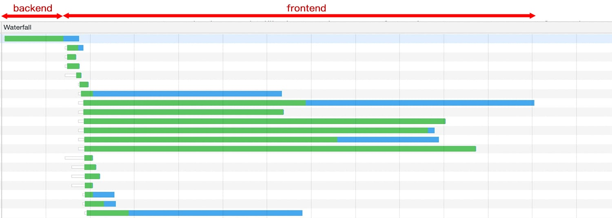

# 🚵 前端性能优化之旅 🚀

## 前端需要性能优化么？

前端性能优化一直以来都是前端工程领域中的一个重要部分。很多研究都表明，网站应用的性能（加载速度、交互流畅度）优化对于提高用户留存、转化率等都有积极影响[1][2][3]。所以很多时候，提升你的网站性能就是提升你的业务数据（甚至是直接收入）。

而性能优化其实广义上会包含前端优化和后端优化。后端优化更多的时候关注点在于增加资源利用率、降低资源成本以及提高稳定性。相较于后端，前端的性能优化会更直接与用户的体验挂钩。在用户体验侧来说，后端从 50ms 优化到 10ms 对的体验感知可能不如前端从 5s 优化到 1s 来的明显。因此很多体验提升的性能优化的瓶颈会出现在前端。

## 如何学习前端性能优化？

在我和一些同学接触的过程中，发现作为前端工程师，大家其实都具备一定的性能优化意识，同时也有自己的优化“武器库”，例如懒加载、资源合并、避免 reflow 等等。虽然大家对性能优化都有自己的思路，不过大多集中在某几个点，较难形成一个完整的体系。业界也有很多优质的资料，例如[雅虎的性能优化 35 条](https://github.com/creeperyang/blog/issues/1)[4]，但是**性能优化作为一个系统性工程**，大家想要系统性地去学习并不容易。

它包括了从用户开始来访问你的网站应用，到最终它在上面浏览信息、操作交互，其间经历了非常多的环节，每个环节都有可能带来性能问题，同时也是我们实现性能提升机会。所以，前端性能优化会要求你去从整体维度来分析系统，甚至是业务。

那么如何能够更有效来梳理与理解性能优化呢？回想到每每面试都会被问到：“从输入XXX到访问之间经历了什么”？其实我们也可以从这个视角来看待性能优化。

从访问开始，用户可能会经历类似「缓存 -> 发送请求 -> 等待响应 -> 解析 -> 处理各类静态资源 -> 运行时 -> 预加载（等待后续的请求）」这样一个“旅程”。这也构成了我们的「性能优化之旅」。Web 应用在其中每一站都可能遇到性能问题，当然也会有应对的优化手段。

所以在这次的「性能优化之旅」中，我会针对每个环节具体介绍其中常见的性能问题，以及优化技术。通过将它们与 Web 应用的访问流程相结合，帮助大家更好理解与掌握前端的性能优化。

如果准备好了，咱们就可以出发了 ——

[第一站 - 缓存 🔜](./1-cache/README.md)

## 旅途的行程路线

> 喜欢请 `star` 一下。订阅请 `watch`。

下图里是这次「性能优化之旅」的行程路线（大纲），如果想直接了解某个部分也可以点击下面的列表：

旅途站点列表

- [第一站 - 缓存](./1-cache/README.md)
- [第二站 - 发送请求](./2-request/README.md)
- [第三站 - 服务端处理](./3-response/README.md)
- [第四站 - 下载与解析页面](./4-parse/README.md)
- [第五站 - 页面静态资源](./5-subresources/README.md)
  - [JavaScript](./5-subresources/javascript.md)
  - [CSS](./5-subresources/css.md)
  - [图片](./5-subresources/image.md)
  - [字体](./5-subresources/font.md)
  - [视频](./5-subresources/video.md)
- [第六站 - 运行时](./6-runtime/README.md)
- [第七站 - 预加载](./7-preload/README.md)
- [尾声](./END.md)
- TODO:
  - 性能指标
  - 性能监控

## 参考资料

1. [Driving user growth with performance improvements](https://medium.com/@Pinterest_Engineering/driving-user-growth-with-performance-improvements-cfc50dafadd7)
1. [How Fast Should A Website Load in 2019?](https://www.hobo-web.co.uk/your-website-design-should-load-in-4-seconds/)
1. [How long will you wait for a shopping website to load?](https://www.bbc.com/news/business-37100091)
1. [Best Practices for Speeding Up Your Web Site (Yahoo)](https://github.com/creeperyang/blog/issues/1)
1. [17 Things People Absolutely Hate About Your Website](https://blog.hubspot.com/blog/tabid/6307/bid/32307/15-things-people-absolutely-hate-about-your-website.aspx)
1. [Why Performance Matters](https://developers.google.com/web/fundamentals/performance/why-performance-matters/)

---

除注明外，本仓库内文章均采用 [Creative Commons BY-NC-ND 4.0](https://creativecommons.org/licenses/by-nc-nd/4.0/deed.zh) 协议。

